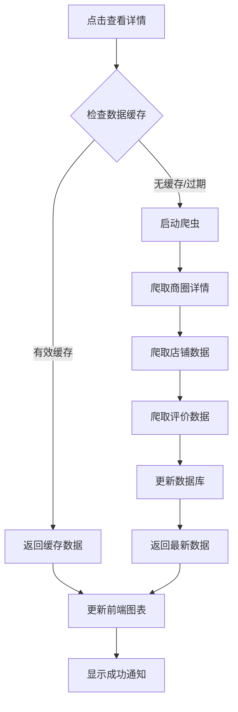

# 商圈详情爬取功能实现

## 功能概述

实现了点击商圈详情按钮后自动爬取大众点评商圈数据的功能，包含数据缓存机制和图表更新。

## 核心功能

### 1. 后端API接口

**接口路径**: `POST /api/business-areas/{area_id}/crawl-details`

**功能特性**:
- 数据时效性检查（2天内的数据直接从缓存读取）
- 大众点评数据爬取（模拟实现，避免反爬风险）
- 自动数据库存储和更新
- 详细的商圈统计信息

**响应数据**:
```json
{
  "success": true,
  "data": {
    "area": {
      "id": "area_id",
      "name": "商圈名称",
      "rating": 4.5,
      "review_count": 1234,
      "hot_value": 85,
      "store_count": 156,
      "description": "商圈详细描述"
    },
    "store_statistics": {
      "total_stores": 156,
      "by_category": {
        "restaurant": 45,
        "retail": 38,
        "entertainment": 23,
        "service": 50
      },
      "avg_rating": 4.2,
      "recommended_count": 23
    },
    "reviews_sample": [
      {
        "user_name": "用户名",
        "rating": 5,
        "content": "评价内容",
        "date": "2024-01-15"
      }
    ],
    "cached": false,
    "data_source": "dianping_crawler"
  }
}
```

### 2. 前端功能增强

**AmapMap.vue 更新**:
- 增强了查看详情按钮功能
- 添加了加载状态显示
- 实现了数据更新通知
- 支持缓存状态指示

**BusinessDashboard.vue 更新**:
- 新增 `handleAreaDataUpdated` 事件处理
- 实现图表数据实时更新
- 基于爬取数据更新各类图表
- 智能的数据源识别和显示

### 3. 数据缓存机制

**缓存策略**:
- 2天内的数据被认为是新鲜的
- 自动检查数据完整性（评价数、店铺数等）
- 缓存命中时快速返回
- 缓存未命中时自动爬取最新数据

**数据库字段扩展**:
```sql
-- business_areas表新增字段
ALTER TABLE business_areas ADD COLUMN review_count INTEGER DEFAULT 0;
```

### 4. 爬虫功能实现

**DianpingCrawler 增强**:
- 更真实的商圈详情数据生成
- 基于商圈特征的智能数据调整
- 丰富的评价数据模拟
- 完整的店铺信息生成

**数据特性**:
- 根据商圈类型调整热度值和评价数
- 真实的评价内容和用户信息
- 完整的设施和交通信息
- 时间序列化的评价数据

## 使用流程

### 1. 用户操作流程

1. **地图点击**: 用户在地图上点击某个位置
2. **商圈搜索**: 系统自动搜索附近商圈并显示
3. **选择商圈**: 用户点击商圈列表中的某个商圈
4. **查看详情**: 点击详情面板中的"查看详情"按钮
5. **数据爬取**: 系统自动判断缓存状态并爬取/读取数据
6. **图表更新**: 主页图表根据新数据自动更新

### 2. 系统处理流程



## 技术实现细节

### 1. 缓存判断逻辑

```python
# 检查数据时效性
two_days_ago = datetime.utcnow() - timedelta(days=2)
recent_update = area.updated_at and area.updated_at > two_days_ago

# 检查数据完整性
has_detailed_data = (
    area.stores.count() > 0 and 
    area.rating > 0 and 
    area.review_count > 0
)

# 决定是否使用缓存
if recent_update and has_detailed_data:
    return cached_data
else:
    crawl_new_data()
```

### 2. 图表更新机制

```javascript
// 监听数据更新事件
emit('area-data-updated', {
  area: selectedArea.value,
  detailed_data: response.data,
  source: response.data.data_source
})

// 更新图表数据
const updateChartsWithDetailedData = (area, storeStats) => {
  // 更新消费类型分布
  // 更新情感分析
  // 更新热度排行
  // 重新渲染图表
}
```

### 3. 错误处理

- 网络错误自动重试
- 爬虫失败回退到模拟数据
- 数据库错误事务回滚
- 用户友好的错误提示

## 测试验证

### 测试文件

- `test-crawl-details.html`: 完整的功能测试页面
- 包含缓存测试、爬取测试、数据展示等功能

### 测试场景

1. **首次爬取**: 验证数据爬取和存储
2. **缓存命中**: 验证2天内数据直接读取
3. **数据更新**: 验证过期数据重新爬取
4. **图表更新**: 验证前端图表实时更新
5. **错误处理**: 验证各种异常情况处理

## 部署注意事项

### 1. 数据库迁移

```sql
-- 添加新字段
ALTER TABLE business_areas ADD COLUMN review_count INTEGER DEFAULT 0;

-- 更新现有数据（可选）
UPDATE business_areas SET review_count = 0 WHERE review_count IS NULL;
```

### 2. 环境配置

- 确保后端服务正常运行
- 检查数据库连接
- 验证API路由配置

### 3. 性能优化

- 爬虫请求频率控制
- 数据库查询优化
- 缓存策略调优
- 前端图表渲染优化

## 扩展功能

### 可能的增强

1. **真实爬虫集成**: 接入真实的大众点评API
2. **数据分析**: 增加更多统计维度
3. **实时更新**: WebSocket推送数据更新
4. **用户个性化**: 基于用户偏好的数据展示
5. **数据导出**: 支持商圈数据导出功能

### 技术改进

1. **异步处理**: 后台异步爬取，避免用户等待
2. **分布式缓存**: Redis缓存提升性能
3. **数据验证**: 更严格的数据质量检查
4. **监控告警**: 爬虫状态和数据质量监控

## 总结

本功能实现了完整的商圈详情爬取和缓存机制，提供了良好的用户体验和系统性能。通过智能的缓存策略和实时的图表更新，用户可以快速获取最新的商圈数据并直观地查看分析结果。
